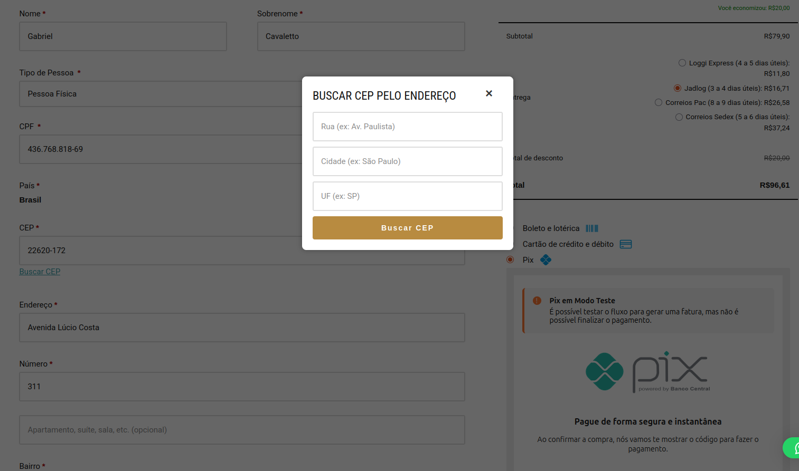
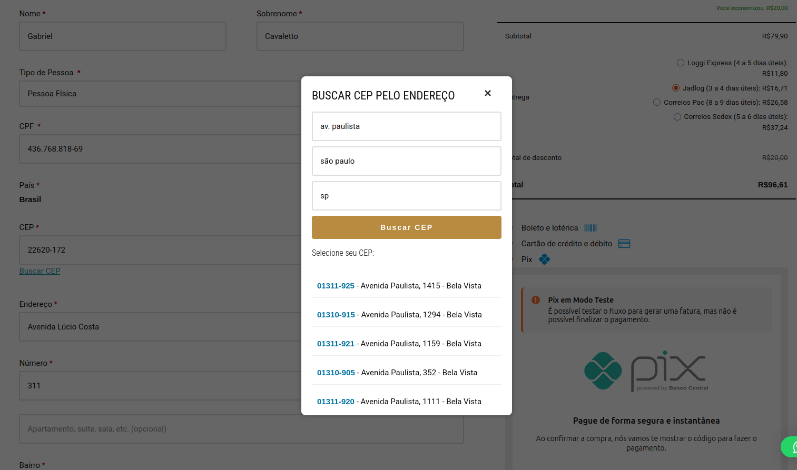
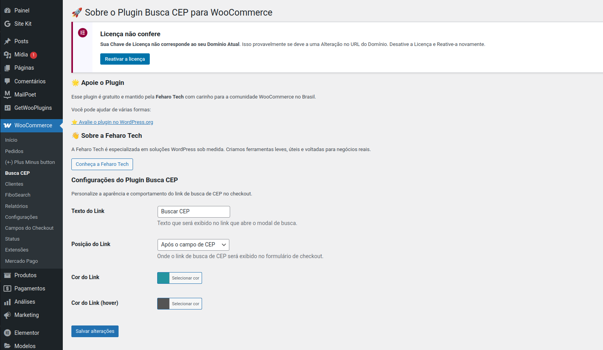

# WooCommerce Busca CEP por Endereço

Plugin para WooCommerce que permite aos clientes buscar o CEP preenchendo o endereço diretamente no checkout.

## ✨ Recursos

- 🔍 Busca de CEP por endereço (logradouro, cidade e UF)
- 🛒 Integração perfeita com o checkout do WooCommerce
- ✨ Preenchimento automático dos campos de endereço
- 📋 Suporte a múltiplos resultados de CEP
- 🎨 Totalmente personalizável (texto, posição e cores)
- 📌 Shortcode `[busca_cep]` para uso em qualquer página
- 🌍 Tradução pronta (pt_BR e en_US)

## 📥 Instalação

1. Baixe o [último release](https://github.com/Feharo-Tech/woocommerce-busca-cep/releases/tag/v1.1.1)
2. No WordPress, vá em **Plugins > Adicionar Novo > Enviar Plugin**
3. Faça upload do arquivo ZIP baixado
4. Ative o plugin
5. Configure em **WooCommerce > Busca CEP**

## ⚙️ Configuração

Configure facilmente:

- Texto do link
- Posição do link (antes/depois do campo CEP)
- Cores do link (normal e hover)

## 🎮 Como Usar

### No Checkout

O plugin adiciona automaticamente um link "Não sei meu CEP" no formulário de checkout.

### Via Shortcode

Use `[busca_cep]` em qualquer página ou widget para exibir o formulário de busca.

## 📚 Documentação

Consulte nossa [wiki](https://github.com/feharotech/woocommerce-busca-cep/wiki) para:

- Guia de instalação detalhado
- Personalização avançada
- Solução de problemas

## 🤝 Contribuição

Contribuições são bem-vindas! Siga estes passos:

1. Faça um fork do projeto
2. Crie sua branch (`git checkout -b feature/nova-feature`)
3. Commit suas mudanças (`git commit -m 'Adiciona nova feature'`)
4. Push para a branch (`git push origin feature/nova-feature`)
5. Abra um Pull Request

## 📜 Changelog

### 1.1.1

- Adicionado shortcode `[busca_cep]`
- Melhorias na validação dos campos
- Correções de bugs

### 1.1.0

- Página de configurações
- Personalização de texto, posição e cores
- Melhor tratamento de erros

[Ver changelog completo](CHANGELOG.md)

## ⚖️ Licença

Este plugin é licenciado sob [GPLv2](https://www.gnu.org/licenses/gpl-2.0.html).

---

Desenvolvido com ❤️ por [Feharo Tech](https://feharo.com.br)
